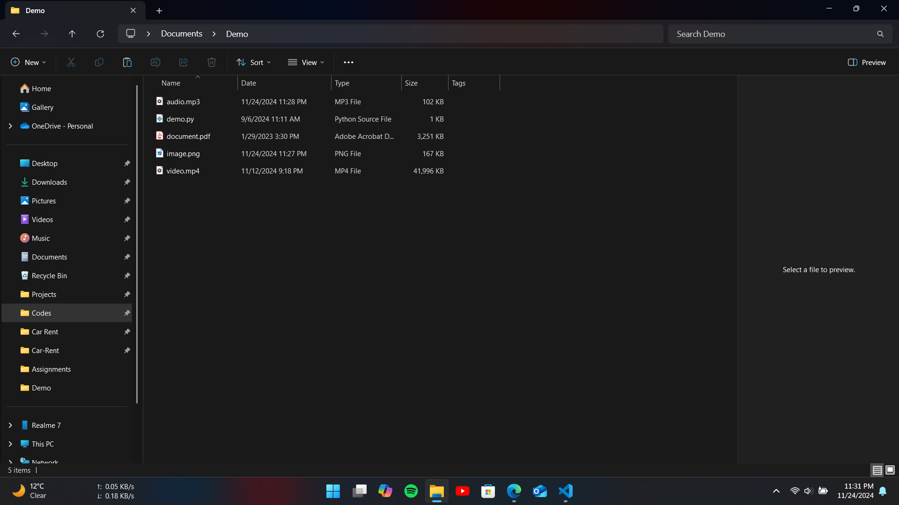
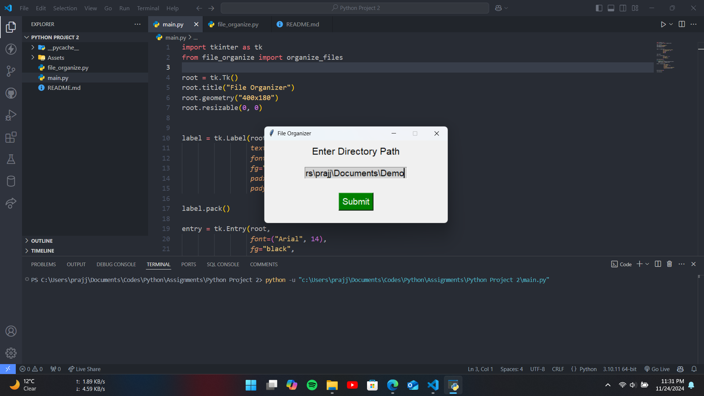
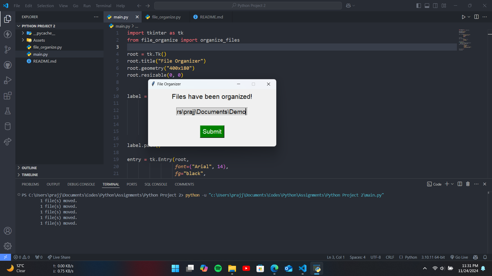
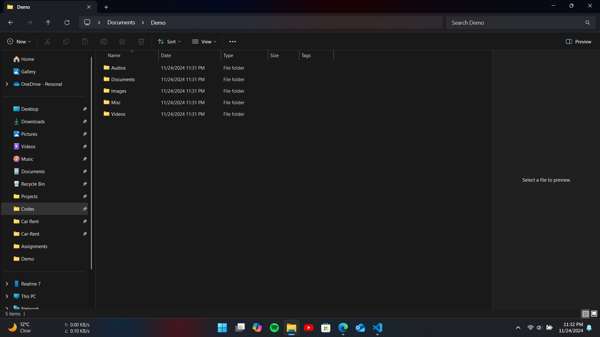

# File Organizer

## Overview

The **File Organizer** is a Python-based tool that allows users to organize their files with a graphical user interface (GUI). This project uses the `os` library for organizing the files and `tkinter` for creating the GUI.

## Features

- Easy-to-use graphical interface with `tkinter`.
- Organizes the files into folders based on their types.

## Usage

1. Launch the program by running `main.py`.
2. The GUI will open with one field:
   - **Enter Directory Path**: Enter the path of the directory to organize
3. Click **Submit** button to organize the files.
4. **Files have been organized!** appears upon successful fetching.

## Screenshots

---